# Penjelasan Cara Kerja

## Kurva Linear

Kurva Linear akan mengambil 2 masukan yaitu
  
- a : titik awal
- b : titik akhir

Kurva Linear dibedakan menjadi 2 jenis, yaitu

- Kurva Linear Naik
- Kurva Linear Turun

### Kurva Linear Naik

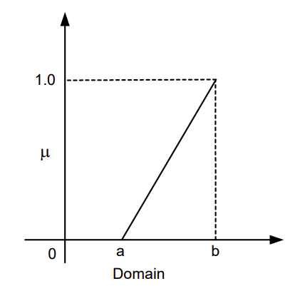

Rumus untuk menentukan derajat keanggotaan dari suatu nilai pada Kurva Linear Naik adalah dengan menggunakan rumus berikut

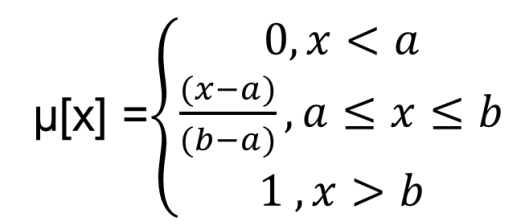

Yang diterjemahkan dalam bentuk Flowchart sebagai


Yang diterjemahkan ke dalam bentuk program python, menjadi

```python
a = 10
b = 20
nilai = 15
derajat = 0

def linear_naik(a, b, x):
    if x <= a:
        return 0
    elif x >= b:
        return 1
    elif x > a and x < b:
        return (x-a)/(b-a)

derajat = linear_naik(a, b, nilai)

```

Rumus yang digunakan mendapat sedikit penyeseuain pada, karena dengan rumus seperti ini akan memiliki tipe data output

```
a < x           -> Output Int
a <= x <= b     -> Output Float/Double
b > x           -> Output Int
```

Tetapi jika nilai "x" merupakan nilai yang sama dengan nilai "b" atau "a", maka output yang dikerluarkan ``` a <= x <= b ``` akan menjadi nilai 0.0 atau 1.0 karena nilai "x" mengalami proses perhitungan, jadi rumus akan diubah seperti ini

```
a <= x      -> Output Int
a < x < b   -> Output Float/Double
b >= x      -> Output Int
```

Dengan seperti diatas maka tidak akan ada output nilai 0 atau 1 dengan tipe data Float/Double.
* * *

### Kurva Linear Turun

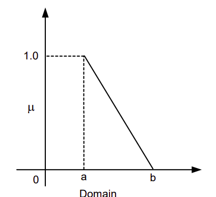

Rumus untuk menentukan derajat keanggotaan dari suatu nilai pada Kurva Linear Naik adalah dengan menggunakan rumus berikut

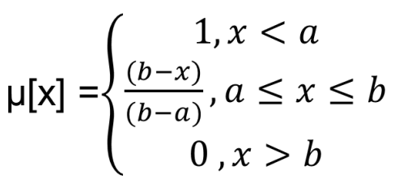

Yang diterjemahkan dalam bentuk Flowchart sebagai

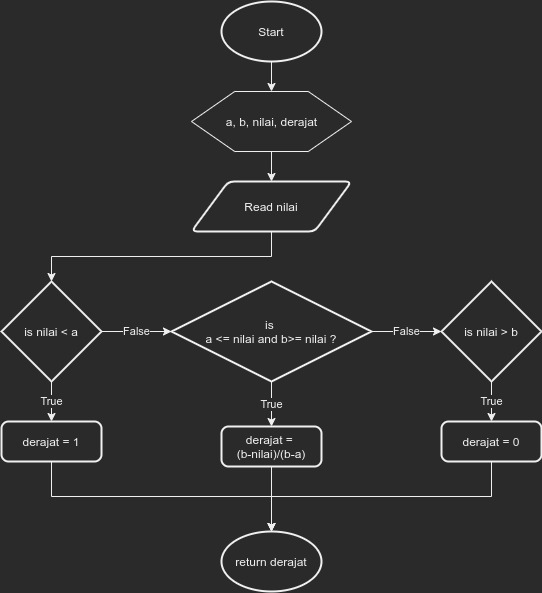

Yang diterjemahkan ke dalam bentuk program python, menjadi

```python
a = 10
b = 20
nilai = 15
derajat = 0

def linear_turun(a, b, x):
    if x <= a:
        return 1
    elif x >= b:
        return 0
    elif x > a and x < b:
        return (b-x)/(b-a)
    return False

derajat = linear_turun(a, b, nilai)

```

Rumus juga mendapat penyesuaian sama dengan Kurva Linear Naik

```
a < x           -> Output Int
a <= x <= b     -> Output Float/Double
b > x           -> Output Int
```

* * *

## Kurva Segitiga

Kurva Segitiga akan mengambil 3 masukan yaitu
  
- a : titik awal
- b : titik tengah
- c : titik akhir

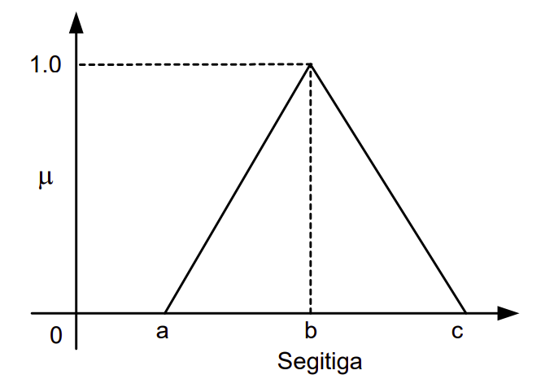

Rumus untuk menentukan derajat keanggotaan dari suatu nilai pada Kurva Linear Naik adalah dengan menggunakan rumus berikut

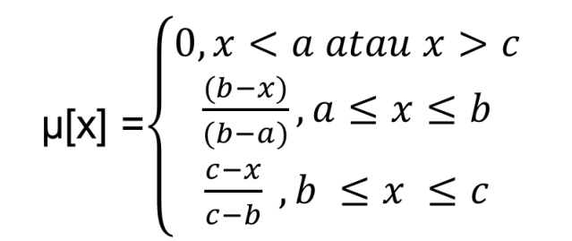

Yang diterjemahkan dalam bentuk flowchart seperti berikut

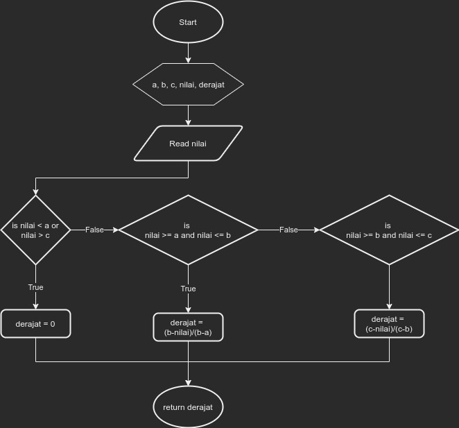

Yang diterjemahkan ke dalam bentuk program python, menjadi

```python
a = 15
b = 25
c = 35
nilai = 23

def segitiga(self, a, b, c, x):
    if x < a or x > c:
        return 0
    elif x >= a and x <= b:
        return (b-x)/(b-a)
    elif x >= b and x <= c:
        return (c-x)/(c-b)
    return False

derajat = segitiga(a, b, c, nilai)
```

Rumus yang didapat terdapat beberapa masalah
1. Adanya output 0.0 dan 1.0 sama seperti kurva linear
2. Jika nilai sama dengan nilai "b" maka derajat keanggotaan adalah 0, tapi nilai sesungguhnya nilai yang harusnya didapat adalah 0

maka dari itu, rumus dirubah menjadi
```
x <= a or x >= c        --> Menghilangkan output 0.0
x == b                  --> Output b adalah 1
x >= a and x < b        --> Mengubah "<= b"
x > b and x <= c        --> Mengubah ">= b"

```

Source code program akan menjadi

```python
def segitiga(self, a, b, c, x):
    if x <= a or x >= c:
        return 0
    elif x == b:
        return 1
    elif x >= a and x < b:
        return (b-x)/(b-a)
    elif x > b and x <= c:
        return (c-x)/(c-b)
```

* * *
## Kurva Trapesium

Kurva Segitiga akan mengambil 4 masukan yaitu
  
- a : titik awal
- b : titik tengah 1
- c : titik tengah 2
- d : titik akhir

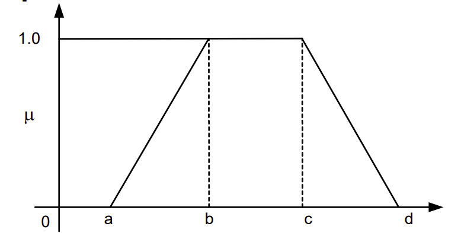

Rumus untuk menentukan derajat keanggotaan dari suatu nilai pada Kurva Linear Naik adalah dengan menggunakan rumus berikut

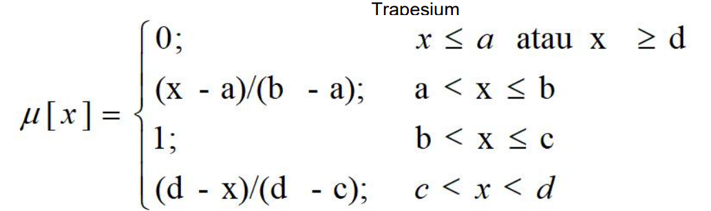

Yang diterjemahkan dalam bentuk flowchart menjadi seperti

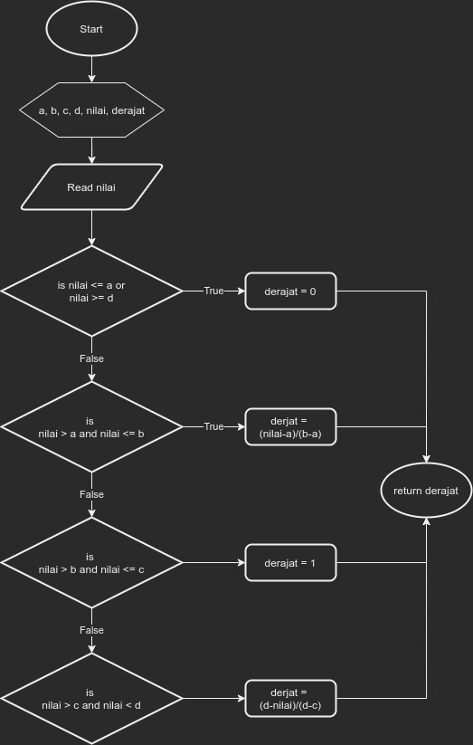

Yang diterjemahkan ke dalam bentuk program python, menjadi

```python
a = 15
b = 24
c = 27
d = 35
nilai = 24

def trapesium(self, a, b, c, d, x):
    if x <= a or x >= d:
        return 0
    elif x > a and x <= b:
        return (x-a)/(b-a)
    elif x > b and x <= c:
        return 1
    elif x > c and x < d:
        return (d-x)/(d-c)

derajat = fk.trapesium(a, b, c, d, nilai)
```

Rumus memliki masalah
> Jika nilai == b maka output adalah bilangan decimal 1

Sehingga rumus disesuaikan menjadi
```
x > a and x < b     --> x == b tidak akan dihitung lagi
x >= b and x <= c   --> x == b akan masuk kesini dan return 1
```

Penerapannya
```python
def trapesium(self, a, b, c, d, x):
    if x <= a or x >= d:
        return 0
    elif x > a and x < b:
        return (x-a)/(b-a)
    elif x >= b and x <= c:
        return 1
    elif x > c and x < d:
        return (d-x)/(d-c)
```